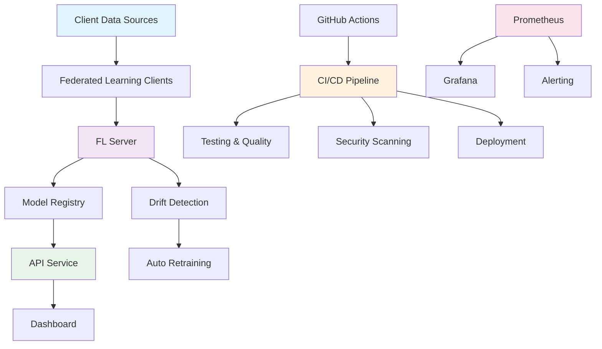

# 🤖 Federated Learning MLOps System

A comprehensive end-to-end MLOps system implementing **Federated Learning** with automated CI/CD pipelines, real-time monitoring, and drift detection.

## 🌟 Features

### 🔄 **Federated Learning**
- **Multi-client training** with Flower framework
- **Data privacy** - Data never leaves client locations
- **Automated aggregation** - FedAvg with drift-aware strategy
- **Real-time drift detection** - PSI + KS-test based monitoring

### 🚀 **MLOps Pipeline**
- **Automated CI/CD** with GitHub Actions
- **Docker-based deployment** with orchestration
- **Model versioning** and registry management
- **Automated retraining** triggered by drift/performance

### 📊 **Monitoring & Observability**
- **Real-time dashboards** with Streamlit
- **Prometheus metrics** collection
- **Grafana visualizations** 
- **Automated alerting** for drift/performance issues

### 🔒 **Production Ready**
- **Security scanning** and vulnerability management
- **Performance testing** and benchmarks
- **Multi-environment deployment** (staging/production)
- **Rollback capabilities** and disaster recovery

## 🏗️ Architecture



## 🚀 Quick Start

### 1. **Clone Repository**
```bash
git clone https://github.com/Ibaadchaudhry/mlops-project.git
cd mlops-project
```

### 2. **Start System (Windows)**
```bash
./start_system.bat
```

### 3. **Start System (Linux/Mac)**
```bash
./start_system.sh
```

### 4. **Access Services**
- 🌐 **Dashboard**: http://localhost:8501
- 🔌 **API**: http://localhost:8000
- 📊 **Prometheus**: http://localhost:9090
- 📈 **Grafana**: http://localhost:3000 (admin/admin)

## 📁 Project Structure

```
mlops-project/
├── 🤖 Federated Learning Core
│   ├── fl_server.py              # Flower server with drift detection
│   ├── fl_client.py              # Flower client implementation
│   ├── model.py                  # TabularMLP neural network
│   └── train_utils.py            # Training utilities
│
├── 📊 Data Pipeline
│   ├── data_ingestion.py         # Multi-source data loading
│   ├── save_clients.py           # Client dataset preparation
│   ├── align_features.py         # Feature alignment utilities
│   └── drift_detector.py         # Drift detection algorithms
│
├── 🚀 Model Serving
│   ├── api_service.py            # FastAPI model serving
│   └── dashboard.py              # Streamlit monitoring dashboard
│
├── 🐳 Infrastructure
│   ├── docker-compose.yml        # Multi-service orchestration
│   ├── Dockerfile.*              # Service-specific containers
│   ├── start_system.bat          # Windows startup script
│   └── monitoring/               # Prometheus & Grafana configs
│
├── 🔄 CI/CD Pipeline
│   └── .github/workflows/        # GitHub Actions workflows
│       ├── ci-cd-pipeline.yml    # Main CI/CD pipeline
│       ├── testing.yml           # Automated testing suite
│       ├── model-training.yml    # ML training automation
│       ├── monitoring.yml        # System monitoring
│       └── deployment.yml        # Production deployment
│
└── 📚 Documentation
    ├── README.md                 # This file
    └── .github/README.md         # CI/CD documentation
```

## 🔄 CI/CD Pipeline

### **Automated Workflows**
- ✅ **Code Quality** - Linting, formatting, type checking
- 🧪 **Testing** - Unit, integration, E2E, performance tests
- 🐳 **Build & Deploy** - Multi-environment Docker deployment
- 🤖 **Model Training** - Automated FL training & validation
- 📊 **Monitoring** - Health checks, drift detection, alerting

### **Deployment Strategies**
- 🔄 **Rolling Updates** - Zero-downtime deployments
- 🔵🟢 **Blue-Green** - Environment switching
- 🐦 **Canary** - Gradual traffic shifting

### **Automated Triggers**
- 📝 **Code Changes** → Testing + Deployment
- 🕐 **Weekly Schedule** → Model Retraining
- 🚨 **Drift Detection** → Auto Retraining
- 📉 **Performance Drop** → Alerts + Investigation

## 🛠️ Development

### **Prerequisites**
- Python 3.9+
- Docker & Docker Compose
- Git

### **Local Development**
```bash
# Install dependencies
pip install -r requirements.txt

# Prepare federated datasets
python save_clients.py

# Run federated learning
python fl_server.py

# Start API service
python api_service.py

# Launch dashboard
streamlit run dashboard.py
```

### **Testing**
```bash
# Unit tests
pytest tests/

# Integration tests
pytest tests/integration/

# Performance tests
pytest tests/performance/ --benchmark-only

# Security tests
bandit -r . && safety check
```

## 📊 Monitoring & Alerting

### **Key Metrics**
- 🎯 **Model Performance** - AUC, Accuracy, F1-Score
- 📈 **Training Progress** - Loss curves, convergence rates
- 🔄 **Data Drift** - PSI values, KS-test statistics
- 🏥 **System Health** - API response times, resource usage

### **Automated Alerts**
- 🚨 **Critical Drift** (>30% features affected) → Auto-retrain
- 📉 **Performance Drop** (>5% decrease) → Investigation
- 💥 **System Failures** → Immediate notification
- 🔒 **Security Issues** → Security team alert

### **Dashboards**
- 📱 **Streamlit UI** - Interactive monitoring & prediction
- 📊 **Grafana** - Time-series metrics visualization
- 🔍 **Prometheus** - Raw metrics & alerting rules

## 🔒 Security

### **Implementation**
- 🔐 **Dependency Scanning** - Automated vulnerability detection
- 🕵️ **Code Analysis** - Static security analysis with Bandit
- 🔒 **Secret Management** - No hardcoded credentials
- 🛡️ **Container Scanning** - Trivy vulnerability scanning

### **Privacy**
- 🏠 **Data Locality** - Training data never leaves clients
- 🔒 **Federated Learning** - Only model updates are shared
- 🎭 **Differential Privacy** - Optional privacy mechanisms

## 🌍 Deployment Environments

### **Staging**
- 🧪 **Automatic deployment** from main branch
- 🔍 **Extended testing** and validation
- 🎮 **Safe experimentation** environment

### **Production**
- 🔒 **Manual approval** required
- 🏥 **Comprehensive health checks**
- 📊 **Performance monitoring**
- 🔄 **Automated rollback** on failure

## 🤝 Contributing

1. **Fork the repository**
2. **Create feature branch** (`git checkout -b feature/amazing-feature`)
3. **Commit changes** (`git commit -m 'Add amazing feature'`)
4. **Push to branch** (`git push origin feature/amazing-feature`)
5. **Open Pull Request**

### **Code Standards**
- ✅ **Black formatting** - `black .`
- 📏 **Import sorting** - `isort .`
- 🔍 **Linting** - `flake8 .`
- 📝 **Type hints** - `mypy .`
- 🧪 **Tests required** - Minimum 80% coverage

## 📚 Documentation

- 🔄 **[CI/CD Pipeline](.github/README.md)** - Detailed workflow documentation
- 🤖 **[Model Training](docs/training.md)** - FL training procedures
- 🚀 **[Deployment Guide](docs/deployment.md)** - Production deployment
- 📊 **[Monitoring Setup](docs/monitoring.md)** - Observability configuration

## 📄 License

This project is licensed under the MIT License - see the [LICENSE](LICENSE) file for details.

## 🙋 Support

- 📧 **Email**: [your-email@domain.com]
- 💬 **Slack**: [#mlops-support]
- 🐛 **Issues**: [GitHub Issues](https://github.com/Ibaadchaudhry/mlops-project/issues)
- 📚 **Docs**: [Project Wiki](https://github.com/Ibaadchaudhry/mlops-project/wiki)

---

**🎯 Built for Production** | **🔒 Enterprise Ready** | **🌍 Open Source**
